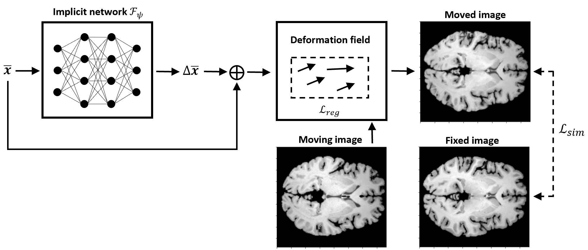

## Brain image registration with implicit neural networks

This repository includes several code examples presenting how implicit neural representations (INRs) can be used for brain image registration.   

INRs serve as a continuous, coordinate-based approximation of the deformation field obtained through a multi-layer perceptron. 

In our work, we investigated various registration approaches based on implicit networks. 

- example_custom presents a simple pytorch code illustrating how to perform the registration with a SIREN model.

# About

If you find this repository useful for your work, consider citing our paper ([bibtex](figures/sci_rep_cit.txt)): 

[Byra, M., Poon, C., Rachmadi, M.F., Schlachter M., Skibbe H. Exploring the performance of implicit neural representations for brain image registration. Sci Rep 13, 17334 (2023)](https://doi.org/10.1038/s41598-023-44517-5)

# Acknowledgement

We used the publically available Mindboggle dataset for the experiments: 

[Klein A, Ghosh SS, Bao FS, Giard J, Hame Y, Stavsky E, Lee N, Rossa B, Reuter M, Neto EC, Keshavan A. (2017) Mindboggling morphometry of human brains.
PLoS Computational Biology 13(3): e1005350](https://doi.org/10.1371/journal.pcbi.1005350)

# TODOS:

- more examples
- more comments
- rewrite

